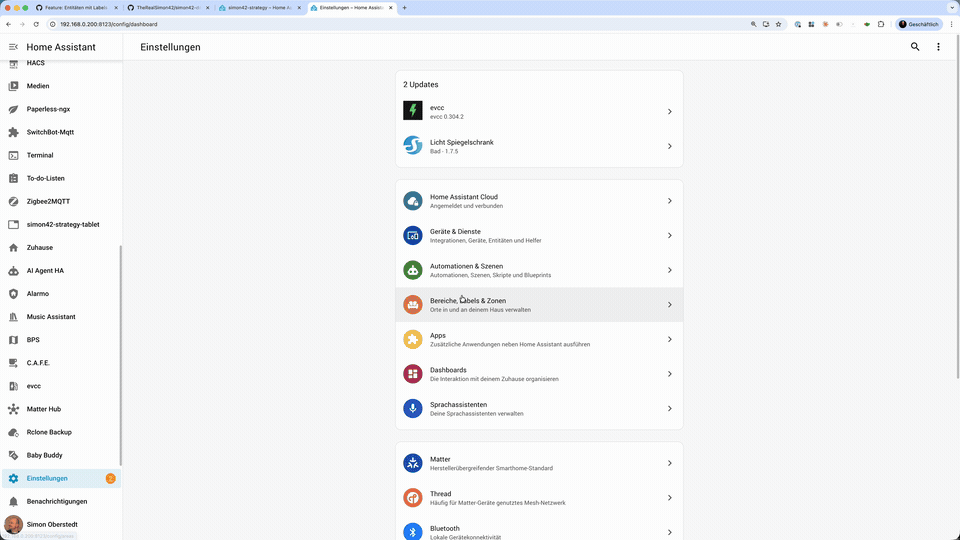

# simon42 Dashboard Strategy

[](https://github.com/hacs/integration)
[](https://github.com/TheRealSimon42/simon42-dashboard-strategy/releases)
[](https://github.com/TheRealSimon42/simon42-dashboard-strategy/stargazers)

[](LICENSE)

Eine modulare und hochkonfigurierbare Dashboard-Strategy für Home Assistant, die automatisch Views basierend auf Bereichen, Entitäten und deren Zuständen generiert.

<p align="center">
  
</p>

[](https://my.home-assistant.io/redirect/hacs_repository/?owner=TheRealSimon42&repository=simon42-dashboard-strategy&category=plugin)

---

## Video-Anleitung

<p align="center">
  <a href="https://youtu.be/XU7DfQrfJ2w">
    
  </a>
  <br/>
  <em>Schritt-für-Schritt Anleitung auf YouTube ansehen</em>
</p>

---

## Unterstütze dieses Projekt

Wenn dir die simon42 Dashboard Strategy hilft, unterstütze die Weiterentwicklung:

<p align="center">
  <a href="https://youtube.com/@simon42/join">
    
  </a>
  <br/>
  <em>Bevorzugte Unterstützung: Werde Kanalmitglied auf YouTube!</em>
  <br/><br/>
  <a href="https://www.buymeacoffee.com/simon42official">
    
  </a>
</p>

---

## Features

- **Grafischer Konfigurator** — Keine YAML-Kenntnisse erforderlich, Drag & Drop für Bereiche
- **Automatische Raum-Erkennung** — Nutzt Home Assistant Areas, Devices & Floors
- **Spezialisierte Views** — Lichter, Rollos, Sicherheit, Batterien, Klima — jeweils mit Status-Gruppierung
- **Zusammenfassungskarten** — Einzeln ein-/ausschaltbar für Lichter, Rollos, Sicherheit, Batterien und Klima
- **Etagen-Gruppierung** — Bereiche und Lichter optional nach Etagen gliedern
- **Favoriten** — Beliebige Entitäten als Kacheln auf der Übersicht anpinnen
- **Alarm-Panel** — Optionale Alarmanlage neben der Uhr
- **Granulare Filterung** — Per Label (`no-dboard`), pro Bereich, pro Domain, pro Entity
- **Teiloffene Rollos** `🆕 Beta` — Optionale dritte Gruppe (Offen / Teiloffen / Geschlossen) mit Live-Übergängen
- **Batch-Aktionen** — Heading-Badges für Gruppensteuerung (alle ein/aus, alle öffnen/schließen)
- **Automationen & Skripte in Räumen** `🆕 Beta` — Bereichs-zugeordnete Automationen und Skripte in Raum-Views anzeigen
- **Eigene Karten** `🆕 Beta` — Beliebige Karten via YAML auf der Übersicht einbinden
- **Eigene Badges** `🆕 Beta` — Beliebige Badges via YAML im Header (neben Personen-Chips)
- **Custom Views** — Eigene Dashboard-Views mit beliebigen Cards via YAML
- **Reaktive Updates** — Echtzeit-Aktualisierung via LitElement Custom Cards
- **Performance-optimiert** — Code-Split Bundles, Registry-Caching, Tile-Card-Pooling

## Installation

### HACS (empfohlen)

[](https://my.home-assistant.io/redirect/hacs_repository/?owner=TheRealSimon42&repository=simon42-dashboard-strategy&category=plugin)

<details>
<summary>Alternative zum Button</summary>

1. Gehe zu HACS → **Custom repositories**
2. Füge das Repository hinzu: `https://github.com/TheRealSimon42/simon42-dashboard-strategy`
3. Installiere die "Simon42 Dashboard Strategy"
4. Folge den Anweisungen in HACS für die Resource-Registrierung

</details>

### Manuelle Installation

<details>
<summary>Manuelle Installationsschritte</summary>

1. Kopiere alle Dateien aus `dist/` nach `/config/www/simon42-strategy/`
2. Füge in `configuration.yaml` hinzu:

```yaml
lovelace:
  mode: storage
  resources:
    - url: /local/simon42-strategy/simon42-dashboard-strategy.js
      type: module
```

3. Starte Home Assistant neu

</details>

## Voraussetzungen

Die Strategy generiert das Dashboard automatisch aus deiner Home Assistant Konfiguration. Damit alles korrekt angezeigt wird:

**Bereiche & Etagen einrichten** — Lege in Home Assistant unter **Einstellungen → Bereiche & Zonen** deine Räume an und weise sie optional Etagen zu. Geräte müssen einem Bereich zugeordnet sein, damit sie im Dashboard erscheinen.

<p align="center">
  
</p>

**Geräte zuweisen** — Weise deine Geräte (Lampen, Sensoren, Rollos etc.) in den HA-Einstellungen einem Bereich zu. Die Strategy erkennt automatisch, welche Entitäten in welchem Raum sind.

**Temperatur & Feuchtigkeit** — Die Bereichskarten auf der Übersicht zeigen Temperatur und Feuchtigkeit nur an, wenn du die Sensoren in den **Home Assistant Bereichseinstellungen** explizit zugewiesen hast (**Einstellungen → Bereiche → Bereich bearbeiten → Temperatur-Sensor / Feuchtigkeits-Sensor**). Eine automatische Erkennung würde bei manchen Setups falsche Sensoren anzeigen (z.B. Drucker-Temperatur im Büro). HA's eigene Home Strategy macht es genauso. In den **Raum-Detail-Views** hingegen werden Sensoren automatisch als Badges erkannt — unerwünschte Badges können über das Label `no-dboard` oder den Strategy-Editor ausgeblendet werden.

**Unerwünschte Entitäten ausblenden** — Nicht jede Entität soll im Dashboard auftauchen. Es gibt drei Wege:

- **Entität nicht sichtbar schalten** (empfohlen) — Setze eine Entität in den HA-Einstellungen auf **"Nicht sichtbar"**. Diese Entitäten werden von allen auto-generierten Strategies ausgeblendet — nicht nur von dieser, sondern auch von HA's eigenen Strategies. Das ist der sauberste Weg, um Entitäten aus automatischen Dashboards zu entfernen.

<p align="center">
  
</p>

- **Label `no-dboard`** — Erstelle in Home Assistant unter **Einstellungen → Labels** ein Label `no-dboard` und weise es Entitäten zu. Die Entität wird aus allen simon42-Strategy-Dashboards global ausgeblendet, bleibt aber in anderen (manuellen) Dashboards sichtbar.

<p align="center">
  
</p>

- **Im Strategy-Editor ausblenden** — Über das Konfigurationsmenü der Strategy können einzelne Entitäten pro Bereich und Domain individuell ein- und ausgeblendet werden. Das betrifft nur diese eine Strategy-Ansicht.

Mehr zur Filterung findest du im Abschnitt [Entity-Filterung](#entity-filterung).

## Dashboard erstellen

<p align="center">
  
</p>

1. **Einstellungen** → **Dashboards** → **Dashboard hinzufügen**
2. **Neues Dashboard von Grund auf**, Name vergeben
3. Dashboard öffnen → **Edit-Modus** (oben rechts)
4. **Drei Punkte** (⋮) → **Raw-Konfigurationseditor**
5. Einfügen:

```yaml
strategy:
  type: custom:simon42-dashboard
```

6. Speichern — der grafische Editor öffnet sich automatisch.

## Konfiguration

Alle Einstellungen lassen sich bequem über den **grafischen Editor** vornehmen (Stift-Icon → Drei Punkte → Dashboard bearbeiten). Die folgenden Abschnitte dokumentieren die verfügbaren Optionen.

<p align="center">
  
</p>

### Übersicht

Die Hauptseite des Dashboards zeigt eine Übersicht mit folgenden Bereichen:

**Uhr & Alarm** — Die Uhr wird standardmäßig angezeigt. Optional kann eine Alarmanlage daneben eingeblendet werden.

**Zusammenfassungen** — Kacheln die den Status aller Lichter, Rollos, Sicherheits-Entitäten, Batterien und Klimageräte zusammenfassen. Jede Zusammenfassung kann einzeln ein- oder ausgeschaltet werden. Das Layout ist als 2-Spalten-Grid (Standard) oder 4-Spalten-Reihe konfigurierbar. Für Rollos kann optional eine **Teiloffen-Gruppe** aktiviert werden, die Rollos mit Position zwischen 1-99% separat anzeigt — inkl. Live-Übergängen während des Fahrens.

<p align="center">
  
</p>

**Batterie-Optionen** — Mobile-App-Batterien (Smartphones, Tablets) können ausgeblendet werden. Die Schwellwerte für die Statusgruppen (Kritisch / Niedrig / Gut) sind frei einstellbar. Nicht erreichbare Sensoren werden automatisch als kritisch eingestuft.

<p align="center">
  
</p>

**Info-Karten** — Optionale Wetter- und Energie-Karten auf der Übersicht.

**Favoriten** — Beliebige Entitäten, die als Kacheln unter den Zusammenfassungen erscheinen. Im Editor per Dropdown hinzufügen.

<p align="center">
  
</p>

### Bereiche & Räume

**Etagen-Gruppierung** — Bereiche können nach Etagen gegliedert werden. Jede Etage bekommt eine eigene Section mit Überschrift.

<p align="center">
  
</p>

**Schlösser in Räumen** — Optional können Schlösser (z.B. Nuki) in den Raum-Views angezeigt werden. Unabhängig davon erscheinen sie immer in der Sicherheits-Übersicht.

**Bereichssortierung** — Wahlweise die Reihenfolge aus Home Assistant verwenden oder im Editor per Drag & Drop festlegen.

<p align="center">
  
</p>

**Bereichs-Verwaltung** — Bereiche ein-/ausblenden, Reihenfolge anpassen, Entitäten pro Bereich und Domain filtern — alles im Editor.

**Raum-Pins** — Spezielle Entitäten die in ihren zugeordneten Räumen ganz oben erscheinen. Ideal für Entitäten die nicht automatisch erkannt werden (z.B. Wetterstationen).

**Automationen & Skripte** — Optional können dem Bereich zugeordnete Automationen und Skripte in den Raum-Views angezeigt werden. Beide Optionen sind separat aktivierbar und standardmäßig aus.

**Fenster- & Türkontakte** — Optional können Fensterkontakte und Türkontakte als Badges in den Raum-Views angezeigt werden. Zwei getrennte Toggles im Editor, standardmäßig aus. Absolute Luftfeuchtigkeit (z.B. von der Thermal Comfort Integration, `g/m³`) wird automatisch als Badge erkannt.

**Ansichten** — Summary-Views (Lichter, Rollos, etc.) und Raum-Views können optional in der oberen Navigation angezeigt werden.

**Lichter nach Etagen** — In der Lichter-View können Lichter nach Etagen gruppiert werden, mit Ein-/Ausschalt-Button pro Etage.

<p align="center">
  
</p>

### Erweiterte Funktionen

#### Eigene Karten `🆕 Beta`

Beliebige Lovelace-Karten via YAML zur Übersicht hinzufügen. Die Karten erscheinen in einer eigenen Section zwischen den Zusammenfassungen und den Bereichen. Überschrift und Icon der Section sind frei wählbar.

**Tipp:** Erstelle die Karte zuerst in einem normalen Dashboard, kopiere den YAML-Code und füge ihn im Editor ein.

```yaml
# Beispiel: Markdown-Karte
type: markdown
content: "Willkommen zuhause!"
```

<p align="center">
  
</p>

#### Eigene Badges `🆕 Beta`

Beliebige Badges via YAML zum Header der Übersicht hinzufügen — sie erscheinen neben den Personen-Chips.

```yaml
# Beispiel: Sonnen-Badge
type: entity
show_name: false
show_state: true
show_icon: true
entity: sun.sun
```

#### Custom Views

Eigene Dashboard-Views mit beliebigen Cards erstellen. Jede Custom View benötigt einen Titel, Pfad und Icon. Der YAML-Code definiert den Inhalt der View.

```yaml
# Beispiel: View mit Sections-Layout
type: sections
sections:
  - type: grid
    cards:
      - type: markdown
        content: "Meine eigene View"
```

<p align="center">
  
</p>

### Entity-Filterung

Entitäten können auf mehreren Ebenen gefiltert werden:

| Methode | Ebene | Beschreibung |
|---------|-------|-------------|
| Nicht sichtbar schalten | Global | Entität wird aus allen auto-generierten Strategies ausgeblendet |
| Label `no-dboard` | Global | Entität wird nur aus simon42-Strategy-Dashboards ausgeblendet |
| `groups_options.hidden` | Pro Bereich | Entität nur in bestimmtem Bereich ausblenden |
| Entity Registry | Automatisch | Hidden/Disabled Entities werden ignoriert |
| Entity Category | Automatisch | Config/Diagnostic Entities werden ignoriert |

### Alle Optionen (Referenz)

<details>
<summary>Vollständige Konfigurationsreferenz aufklappen</summary>

| Option | Typ | Standard | Beschreibung |
|--------|-----|----------|-------------|
| `show_clock_card` | boolean | `true` | Uhr auf der Übersicht |
| `alarm_entity` | string | — | Alarm-Panel Entity neben der Uhr |
| `show_search_card` | boolean | `false` | Such-Karte (benötigt custom:search-card) |
| `show_light_summary` | boolean | `true` | Lichter-Zusammenfassung |
| `show_covers_summary` | boolean | `true` | Rollo-Zusammenfassung |
| `show_security_summary` | boolean | `true` | Sicherheits-Zusammenfassung |
| `show_climate_summary` | boolean | `false` | Klima-Zusammenfassung |
| `show_battery_summary` | boolean | `true` | Batterie-Zusammenfassung |
| `summaries_columns` | 2 \| 4 | `2` | Spalten-Layout der Zusammenfassungen |
| `hide_mobile_app_batteries` | boolean | `false` | Mobile-App-Batterien ausblenden |
| `battery_critical_threshold` | number | `20` | Schwellwert für kritische Batterien (%) |
| `battery_low_threshold` | number | `50` | Schwellwert für niedrige Batterien (%) |
| `show_weather` | boolean | `true` | Wetter-Karte |
| `show_energy` | boolean | `true` | Energie-Dashboard |
| `favorite_entities` | string[] | `[]` | Favoriten-Entitäten auf der Übersicht |
| `group_by_floors` | boolean | `false` | Bereiche nach Etagen gliedern |
| `show_partially_open_covers` | boolean | `false` | Teiloffene Rollos separat anzeigen `🆕 Beta` |
| `show_locks_in_rooms` | boolean | `false` | Schlösser in Raum-Views |
| `show_automations_in_rooms` | boolean | `false` | Automationen in Raum-Views `🆕 Beta` |
| `show_scripts_in_rooms` | boolean | `false` | Skripte in Raum-Views `🆕 Beta` |
| `show_window_contacts_in_rooms` | boolean | `false` | Fensterkontakte als Badges in Raum-Views |
| `show_door_contacts_in_rooms` | boolean | `false` | Türkontakte als Badges in Raum-Views |
| `use_default_area_sort` | boolean | `false` | HA-Sortierung für Bereiche verwenden |
| `areas_display.hidden` | string[] | `[]` | Ausgeblendete Bereiche |
| `areas_display.order` | string[] | `[]` | Reihenfolge der Bereiche |
| `areas_options` | object | `{}` | Entity-Filterung pro Bereich |
| `room_pin_entities` | string[] | `[]` | Raum-Pin Entitäten |
| `show_summary_views` | boolean | `false` | Summary-Views in Navigation |
| `show_room_views` | boolean | `false` | Raum-Views in Navigation |
| `group_lights_by_floors` | boolean | `false` | Lichter nach Etagen gruppieren |
| `custom_cards` | object[] | `[]` | Eigene Karten via YAML `🆕 Beta` |
| `custom_cards_heading` | string | `"Eigene Karten"` | Überschrift der Custom Cards Section `🆕 Beta` |
| `custom_cards_icon` | string | `"mdi:cards"` | Icon der Custom Cards Section `🆕 Beta` |
| `custom_badges` | object[] | `[]` | Eigene Badges im Header via YAML `🆕 Beta` |
| `custom_views` | object[] | `[]` | Eigene Views via YAML |

</details>

## Fehlerbehebung

| Problem | Lösung |
|---------|---------|
| Dashboard zeigt alte Version | **Hard-Refresh:** `Cmd+Shift+R` (Mac) / `Ctrl+Shift+R` (Windows) |
| Änderungen werden nicht übernommen | In einem **Incognito-/Privat-Fenster** testen — wenn das Problem dort nicht auftritt, ist es ein Browser-Cache-Problem |
| Welche Version ist installiert? | Browser-Konsole öffnen (F12) → Meldung `Simon42 Dashboard Strategy vX.Y.Z loaded` suchen |
| Strategy-Timeout auf langsamen Verbindungen | Normal bei Slow 4G — HA hat ein festes 5-Sekunden-Limit für Custom Elements. Bei normalen Verbindungen kein Problem |

## Contributing

Issues und Pull Requests sind willkommen! Bitte teste PRs gründlich in einem lokalen HA-Setup.

<details>
<summary>Architektur</summary>

### Code-Split Bundles

**TypeScript** (ES2020, strict) → **Webpack** → Code-Split Chunks:

| Chunk | Größe | Inhalt |
|-------|-------|--------|
| main | ~5 KB | Entry Point, Custom Element Registrierung |
| lit | ~15 KB | Lit Framework (shared) |
| core | ~31 KB | Registry, Utils, Overview, Custom Cards |
| views | ~16 KB | Lichter, Rollos, Sicherheit, Batterien, Klima, Raum-Detail |
| editor | ~98 KB | Konfigurations-UI (nur bei Bedarf geladen) |

### Performance-Design

Die Strategy folgt denselben Patterns wie HA's offizielle Home- und Areas-Strategien:

- **Pre-filtered Area-Controls:** Area-Cards bekommen nur Controls die im Raum tatsächlich existieren, nicht pauschal alle.
- **Pre-resolved Views:** Alle Views werden in `generate()` vollständig aufgelöst statt als Strategy-Stubs zurückgegeben.
- **Eager Chunk Loading:** JS-Chunks werden sofort beim Laden des Entry-Points gestartet, nicht erst wenn `generate()` aufgerufen wird.
- **Reaktive Custom Cards:** LitElement mit `willUpdate()` — nur relevante State-Änderungen lösen Re-Renders aus.
- **Tile-Card-Pooling:** DOM-Elemente werden wiederverwendet statt neu erstellt.

</details>

## Lizenz

**Attribution-NonCommercial-ShareAlike 4.0 International (CC BY-NC-SA 4.0)**

- **Teilen & Bearbeiten** erlaubt
- **Namensnennung** erforderlich
- **Nicht kommerziell** — Für kommerzielle Nutzung: **[Kontaktformular](https://www.simon42.com/contact/)**
- **Weitergabe unter gleichen Bedingungen**

Siehe LICENSE-Datei für vollständige Details.

## Credits

- Home Assistant Community
- [js-yaml](https://github.com/nodeca/js-yaml) (MIT) — YAML-Parser
- **Claude** (Anthropic) — Co-Entwickler und Nachtschicht-Begleiter

## Support

- **[GitHub Issues](https://github.com/TheRealSimon42/simon42-dashboard-strategy/issues)**
- **[simon42 Community](https://community.simon42.com/)**

---

**Entwickelt mit Leidenschaft für die Home Assistant Community**
